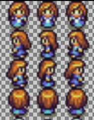
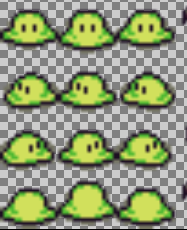
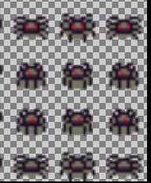

## Story 

Alice is in her dream and found herself in the WONDERLAND where she founds frogs and insects.
She tries to touch the frogs as she believes that a frog can turn into a charming prince with her touch.
There are also insects moving there and could bite her, so she has to be careful with them.

A player has to help Alice to touch frogs, and they can earn points for it. 

At the same time with the bite of each insect the player looses `1` Life. When the life becomes `0` Alice wakes up from 
her dream and the game ends.

## Gameplay

Help Alice to move in the wonderland

- PRESS UP Arrow key to make Alice walk up, in backward direction
- PRESS DOWN Arrow key to make Alice walk down, in front direction
- PRESS RIGHT Arrow key to make Alice walk in right direction
- PRESS LEFT Arrow key to make Alice walk in left direction

### Registration process

- At the beginning of the game a player can write their name in the text box present there and press ENTER key to
register for the game.
- All the unregistered players are treated as `Alien`.

### Scoring System

- By touching every frog a player gets `10` points.
- With the bite of each insect a player looses `1` life.
- A player can view self score along with the top 10 scorers at Leader Board.

## Characters

### Alice

### Frogs

### Insects

## Credits

All the images are taken from [opengameart](https://opengameart.org/)

The image used to generate map file is from [Sharm](https://opengameart.org/content/tiny-16-basic), attribution  [Lanea Zimmerman](https://opengameart.org/content/tiny-16-basic)
